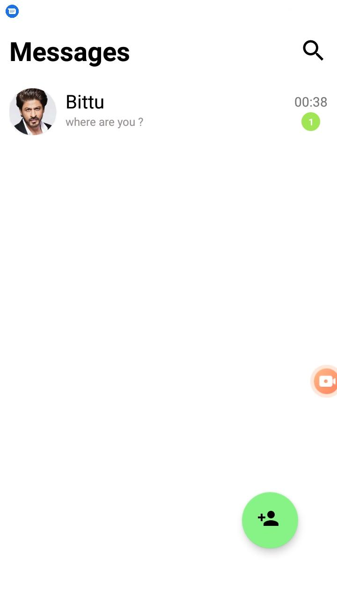
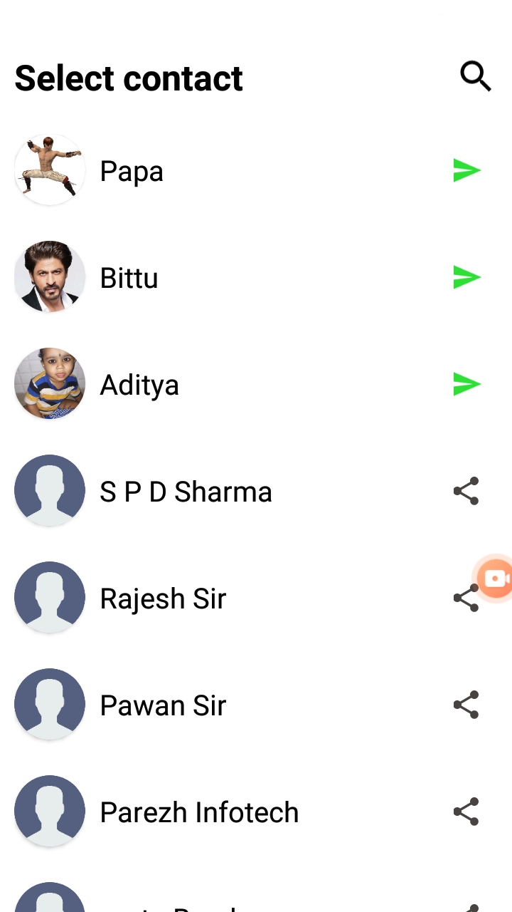
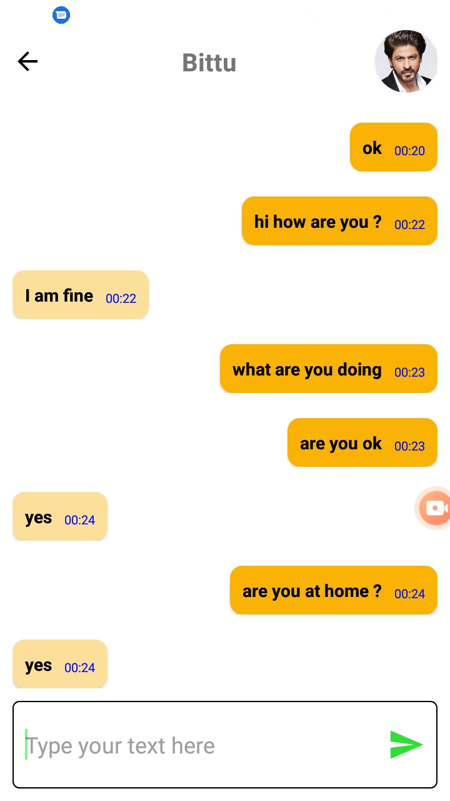
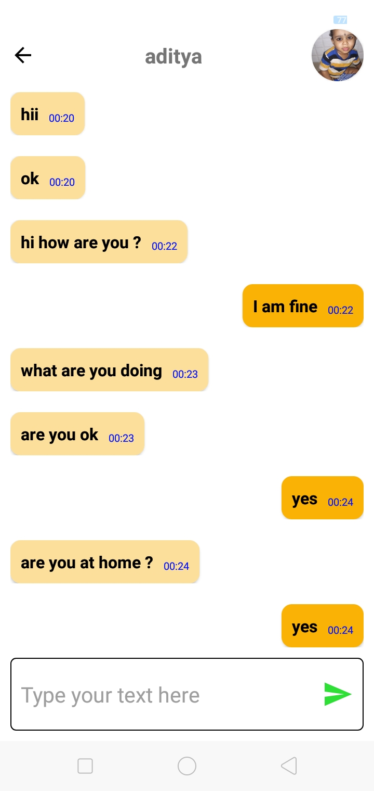
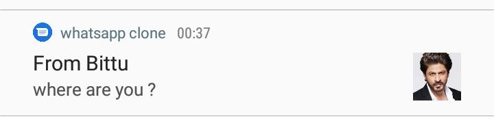

# Whatsapp-clone (text – chat app)
Task of this app is to make conversation from person1 to person2 . it support live chat feature like whatsapp.

# Screen 
   

  

## Notification from the sender 
 &nbsp;
